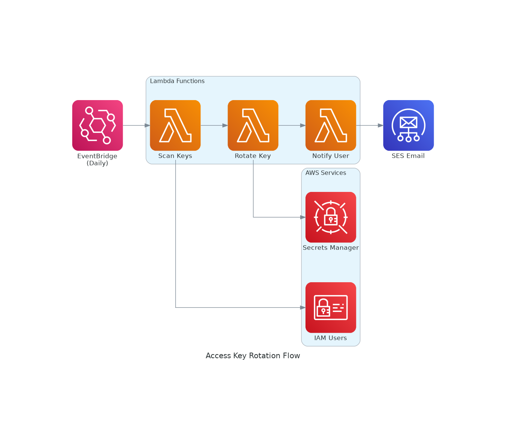
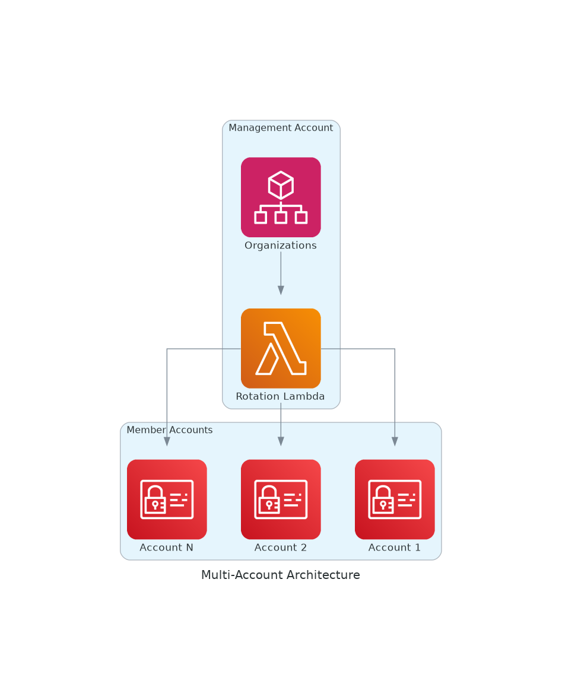

# Architecture

## Main Architecture


## Key Rotation Flow



## Multi-Account Support



## Components

| Component | Purpose |
|-----------|---------|
| EventBridge | Daily trigger for key scanning |
| Lambda | Scan, rotate, notify functions |
| IAM | Access key management |
| Secrets Manager | Secure storage for new keys |
| SES | Email notifications to users |
| Organizations | Multi-account discovery |

## Key Lifecycle

```
Day 0    Day 90      Day 100     Day 110
  |---------|-----------|-----------|
  Create    Rotate      Disable     Delete
            (new key)   (old key)   (old key)
```

## Security Features

- New keys encrypted in Secrets Manager
- Cross-account IAM roles with least privilege
- Audit mode (DryRun) for testing
- Exemption groups for service accounts
- VPC deployment option
